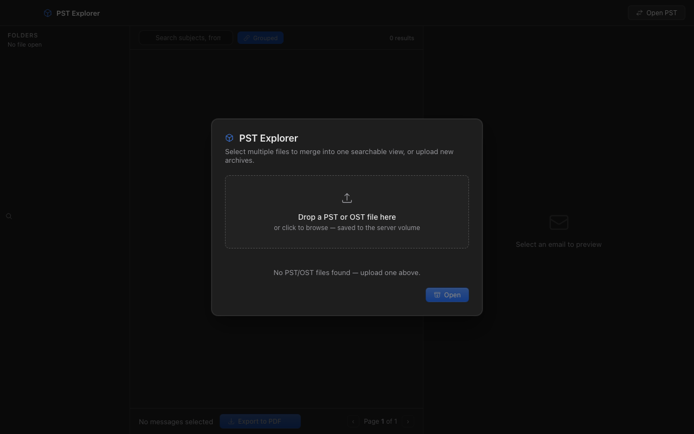

# PST Explorer

A self-contained desktop and web application for browsing, searching, and exporting emails from Microsoft Outlook PST and OST archive files — no Outlook installation required.



## Features

- **Browse folder trees** — Navigate the full folder hierarchy of any PST/OST file, including nested subfolders
- **Full-text search** — Search across subject, sender (From), and recipient (To) fields with regex support (`/pattern/`)
- **Multi-file support** — Open and search across multiple PST/OST files simultaneously as a unified view
- **PDF export** — Select individual or bulk messages and export them as a ZIP of PDFs (preserving HTML formatting)
- **File upload** — Drag-and-drop or click-to-upload PST/OST files directly through the UI
- **Dark mode UI** — macOS-native dark palette with translucent vibrancy effects
- **Offline-capable** — All frontend dependencies (React, Babel) are bundled locally; no CDN or internet required

---

## Deployment Options

### Option 1: Download the Installer (Easiest)

Download the latest `.pkg` installer from [**Releases**](https://github.com/kobylab/pst-explorer/releases/latest).

1. Download **PST-Explorer-1.0.0.pkg**
2. Double-click to install to `/Applications`
3. Open **PST Explorer** from Applications or Spotlight

> The installer includes everything — no .NET SDK, Xcode, or other dependencies needed on the target Mac.

---

### Option 2: Build macOS Native App from Source


A standalone `.app` bundle with a native Swift/WKWebView window. Runs the ASP.NET backend embedded inside the app.

#### Prerequisites

| Dependency | Install |
|---|---|
| **.NET 8 SDK** | `brew install --cask dotnet-sdk` or [download](https://dotnet.microsoft.com/download/dotnet/8.0) |
| **Xcode Command Line Tools** | `xcode-select --install` |

> Both Apple Silicon (arm64) and Intel (x86_64) Macs are supported. The build script auto-detects the architecture.

#### Build

```bash
git clone git@github.com:kobylab/pst-explorer.git && cd pst-explorer
chmod +x build-mac.sh
./build-mac.sh
```

The build takes ~60 seconds and produces:

```
dist/PST Explorer.app    (~115 MB, self-contained — no .NET runtime needed on the target Mac)
```

#### Install & Run

```bash
# Copy to Applications (optional)
cp -R "dist/PST Explorer.app" /Applications/

# Or run directly
open "dist/PST Explorer.app"
```

The app opens a native macOS window (not a browser tab). To quit, close the window or use ⌘Q — the embedded server is terminated automatically.

#### Data Directory

All data lives under `~/Documents/PST Explorer/`:

```
~/Documents/PST Explorer/
├── pst_files/    ← Drop your .pst/.ost files here (or upload via the UI)
├── exports/      ← Exported PDFs appear here
└── pst-explorer.log
```

#### PDF Generation

The app uses [PuppeteerSharp](https://github.com/nicholasgasior/puppeteer-sharp) to render HTML emails to PDF. It automatically detects an installed browser in this order:

1. Google Chrome
2. Brave Browser
3. Microsoft Edge
4. Arc
5. Vivaldi
6. *(Falls back to downloading Chromium if none found)*

No additional configuration is needed — just have any Chromium-based browser installed.

#### App Sandbox

The built app is ad-hoc code-signed with macOS sandbox entitlements:

| Entitlement | Purpose |
|---|---|
| `app-sandbox` | macOS sandbox enabled |
| `network.client` | Connect to localhost backend |
| `network.server` | Run the embedded HTTP server |
| `files.user-selected.read-write` | Open PST files via file picker |
| `files.downloads.read-write` | Save exported PDFs |

---

### Option 3: Docker

Run on any OS with Docker. Uses `wkhtmltopdf` for PDF generation (no browser needed).

#### Quick Start

```bash
git clone git@github.com:kobylab/pst-explorer.git && cd pst-explorer

# Create host directories for data
mkdir -p pst_files exports

# Copy your PST/OST files
cp /path/to/your/archive.pst ./pst_files/

# Build and run
docker compose up -d --build

# Open in browser
open http://localhost:9090
```

#### Ports

| Port | Protocol | URL |
|---|---|---|
| `9090` | HTTP | `http://localhost:9090` |
| `9443` | HTTPS | `https://localhost:9443` (self-signed certificate — accept the browser warning) |

#### Volumes

| Host Path | Container Path | Purpose |
|---|---|---|
| `./pst_files/` | `/data/pst` | PST/OST input files |
| `./exports/` | `/data/exports` | Exported PDF ZIPs |

#### Configuration

Environment variables (set in `docker-compose.yml`):

| Variable | Default | Description |
|---|---|---|
| `PST_DIR` | `/data/pst` | Directory containing PST/OST files |
| `EXPORT_DIR` | `/data/exports` | Directory for exported PDFs |
| `ASPNETCORE_ENVIRONMENT` | `Production` | ASP.NET environment |
| `ASPNETCORE_URLS` | `https://+:8443;http://+:8080` | Kestrel listen URLs |

The container has a `2g` memory limit by default. Increase `mem_limit` in `docker-compose.yml` for very large archives (10GB+ PST files can use 1–2 GB RAM during indexing).

#### Stopping

```bash
docker compose down
```

Your data in `./pst_files/` and `./exports/` is preserved on the host.

---

## Usage

1. **Open** — Click "Open PST" or upload a file via drag-and-drop. You can select multiple files to search across all of them simultaneously.
2. **Browse** — Navigate the folder tree in the left sidebar. Click any folder to view its messages.
3. **Search** — Type in the search bar to filter by subject, sender, or recipient. Wrap in `/slashes/` for regex.
4. **Select** — Check individual messages or use "Select All" to select everything in the current view.
5. **Export** — Click "Export to PDF" to download a ZIP containing one PDF per selected message.

---

## Architecture

```
┌─────────────────────────────────────────────────────────┐
│  macOS: Swift WKWebView window (NSVisualEffectView)     │
│  Docker: Any web browser                                │
├─────────────────────────────────────────────────────────┤
│  Frontend: React 18 SPA (JSX transpiled by Babel)       │
│  Single file: src/wwwroot/index.html                    │
│  Vendor libs: src/wwwroot/vendor/ (React, ReactDOM,     │
│               Babel — all bundled, no CDN)               │
├─────────────────────────────────────────────────────────┤
│  Backend: ASP.NET 8 Minimal API                         │
│  ├─ PstService — XstReader.Api wrapper, multi-file      │
│  │               index with concurrent folder/message   │
│  │               access via SemaphoreSlim               │
│  └─ PdfService — HTML→PDF via PuppeteerSharp (macOS)    │
│                  or wkhtmltopdf (Docker)                 │
├─────────────────────────────────────────────────────────┤
│  Storage: ~/Documents/PST Explorer/ (macOS)             │
│           /data/pst + /data/exports  (Docker)           │
└─────────────────────────────────────────────────────────┘
```

### Key Design Decisions

- **No build step** — The frontend is a single `index.html` with inline JSX transpiled by Babel at runtime. This keeps the project simple with zero Node.js tooling.
- **Self-contained .NET publish** — The macOS app bundles the entire .NET runtime so end users don't need to install .NET.
- **WKWebView, not Electron** — The macOS app uses a ~50KB native Swift launcher instead of a ~150MB Electron shell, resulting in a ~115MB total app size.
- **Multi-file unified index** — When multiple PST files are opened, all messages are merged into a single searchable index with per-file folder path prefixes to maintain origin context.

---

## Project Structure

```
pst-explorer/
├── build-mac.sh                  # macOS .app build script
├── Dockerfile                    # Docker image (multi-stage build)
├── docker-compose.yml            # Docker Compose config
├── macos-app/
│   ├── Info.plist                # macOS bundle metadata (CFBundleIdentifier, etc.)
│   ├── PSTExplorerLauncher.swift # Native Swift launcher (WKWebView, menus, vibrancy)
│   ├── PSTExplorer.entitlements  # App sandbox entitlements
│   ├── DownloadDelegate.swift    # WKDownload handling (file save dialogs)
│   └── NavigationDelegate.swift  # WKNavigation handling (link interception)
├── src/
│   ├── PstWeb.csproj             # .NET 8 project file
│   ├── Program.cs                # Entry point — all API route definitions
│   ├── Models/
│   │   └── Models.cs             # DTOs (OpenRequest, ExportRequest, etc.)
│   ├── Services/
│   │   ├── PstService.cs         # PST/OST parsing, indexing, search, folder tree
│   │   └── PdfService.cs         # HTML→PDF rendering, browser detection, export
│   └── wwwroot/
│       ├── index.html            # React SPA (UI, state management, API calls)
│       └── vendor/               # Bundled frontend dependencies
│           ├── react.production.min.js
│           ├── react-dom.production.min.js
│           └── babel.min.js
└── docs/
    └── images/                   # README screenshots
```

---

## API Reference

All endpoints are served from the embedded ASP.NET server on `http://localhost:9090` (macOS) or `http://localhost:8080` (Docker internal).

### Files & Status

| Method | Endpoint | Description |
|---|---|---|
| `GET` | `/api/pst/files` | List all uploaded PST/OST files in the data directory |
| `GET` | `/api/pst/status` | Current state: `isOpen`, `filename`, `filenames`, `totalMessages` |

### Open & Browse

| Method | Endpoint | Body / Params | Description |
|---|---|---|---|
| `POST` | `/api/pst/open` | `{"filenames": ["a.pst", "b.pst"]}` | Open one or more files and build the unified index |
| `GET` | `/api/pst/folders` | — | Get the folder tree (nested JSON) for all open files |
| `GET` | `/api/pst/messages` | `?folder=...&search=...&page=1&pageSize=100&grouped=false` | Paginated message listing with optional folder filter and search |
| `GET` | `/api/pst/preview/{id}` | — | Full email preview (HTML body, headers, attachments list) |

### Export

| Method | Endpoint | Body | Description |
|---|---|---|---|
| `POST` | `/api/pst/export` | `{"ids": [0,1,2], "zipName": "optional"}` | Export selected messages as a ZIP of PDFs |
| `GET` | `/api/pst/export/{id}/pdf` | — | Download a single message as PDF |

### Upload & Delete

| Method | Endpoint | Body | Description |
|---|---|---|---|
| `POST` | `/api/pst/upload` | `multipart/form-data` with `file` field | Upload a PST/OST file (streams to disk, max 10 GB) |
| `DELETE` | `/api/pst/files/{filename}` | — | Delete an uploaded file (cannot delete currently open files) |

### Query Parameters for `/api/pst/messages`

| Param | Type | Default | Description |
|---|---|---|---|
| `folder` | `string` | — | Filter by folder path (uses `StartsWith` matching) |
| `search` | `string` | — | Search subject, from, and to fields. Wrap in `/slashes/` for regex (5-second timeout). |
| `page` | `int` | `1` | Page number (1-based) |
| `pageSize` | `int` | `100` | Results per page (min: 10, max: 500) |
| `grouped` | `bool` | `false` | Group messages by conversation thread |

---

## Dependencies

| Package | Version | License | Purpose |
|---|---|---|---|
| [XstReader.Api](https://www.nuget.org/packages/XstReader.Api) | 1.0.6 | MS-PL | Parse PST/OST files without Outlook |
| [PuppeteerSharp](https://www.nuget.org/packages/PuppeteerSharp) | 20.0.5 | MIT | HTML→PDF via headless Chromium (macOS) |
| [Serilog.AspNetCore](https://www.nuget.org/packages/Serilog.AspNetCore) | 8.0.1 | Apache-2.0 | Structured logging |
| [Serilog.Sinks.Console](https://www.nuget.org/packages/Serilog.Sinks.Console) | 5.0.1 | Apache-2.0 | Console log output |
| [React](https://react.dev) | 18.x | MIT | UI framework |
| [Babel Standalone](https://babeljs.io) | 7.x | MIT | In-browser JSX transpilation |

Docker mode additionally uses `wkhtmltopdf` (LGPL) for PDF generation.

---

## Security

- **CORS** — Locked to `localhost` origins only
- **Docker ports** — Bound to `127.0.0.1` by default; **do not expose to untrusted networks** — there is no authentication layer
- **File upload** — Accepts only `.pst` and `.ost` extensions; filenames are sanitized to prevent path traversal
- **Regex search** — Timeouts after 5 seconds to prevent ReDoS
- **Export limits** — Maximum 5,000 messages per export request
- **Error responses** — Sanitized; no stack traces or internal paths exposed to the client
- **App sandbox** (macOS) — Runs with macOS App Sandbox entitlements restricting file and network access
- **No telemetry** — The app makes zero outbound network requests (except browser download fallback in PuppeteerSharp if no local browser is found)

---

## Troubleshooting

### macOS App

**"PST Explorer.app is damaged and can't be opened"**
The app is ad-hoc signed (no Apple Developer certificate). Remove the quarantine attribute:
```bash
xattr -cr "dist/PST Explorer.app"
```

**App opens but shows a blank window**
The embedded server may have failed to start. Check the log:
```bash
cat ~/Documents/PST\ Explorer/pst-explorer.log
```
Ensure port 9090 is not already in use:
```bash
lsof -i :9090
```

**PDF export downloads nothing / errors**
PuppeteerSharp needs a Chromium-based browser. Install Chrome, Brave, Edge, or any Chromium browser. Check the log for browser detection messages.

**Build fails with "swiftc: command not found"**
Install Xcode Command Line Tools:
```bash
xcode-select --install
```

**Build fails with "dotnet: command not found"**
Install the .NET 8 SDK:
```bash
brew install --cask dotnet-sdk
```
Or add `~/.dotnet` to your PATH if installed via the dotnet-install script:
```bash
export PATH="$HOME/.dotnet:$PATH"
```

### Docker

**No files showing in "Open PST" dialog**
Ensure your PST files are in `./pst_files/` on the host:
```bash
ls -la ./pst_files/
```

**Container exits immediately**
Check logs:
```bash
docker compose logs pstweb
```

**Out of memory on large PST files**
Increase the memory limit in `docker-compose.yml`:
```yaml
mem_limit: 4g
```

**Self-signed certificate warning**
Expected when accessing `https://localhost:9443`. Accept the browser warning, or use `http://localhost:9090` instead.

---

## License

MIT
